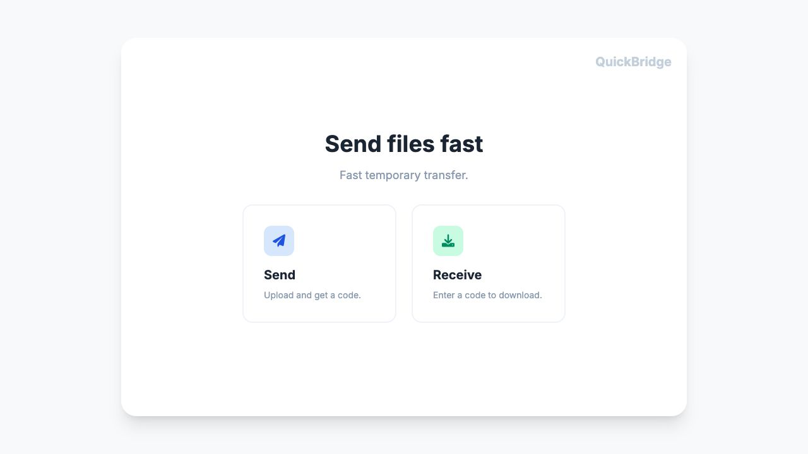
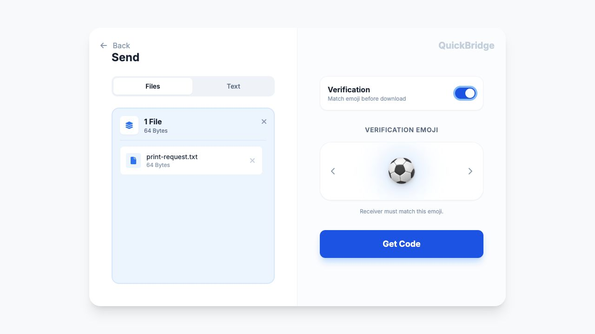
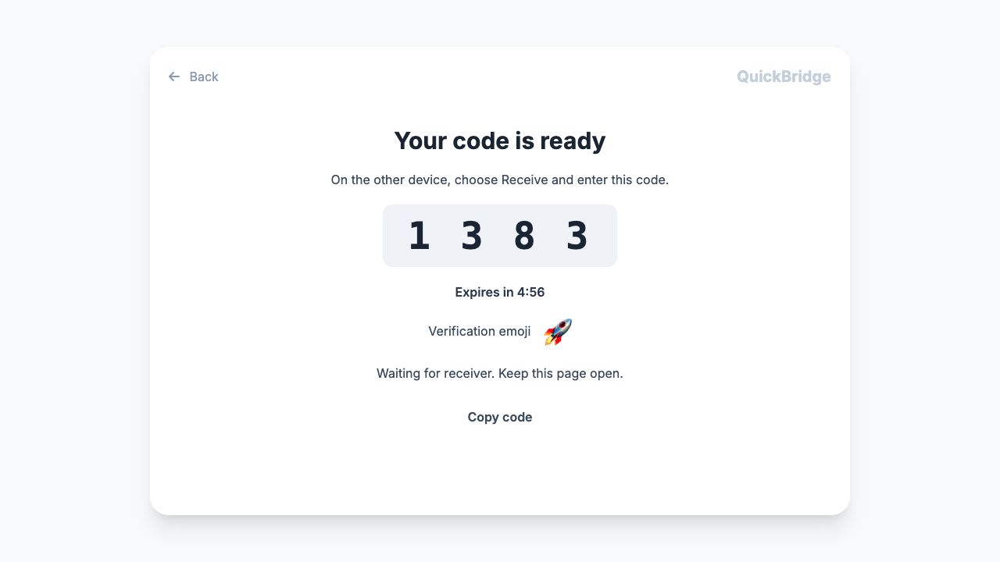
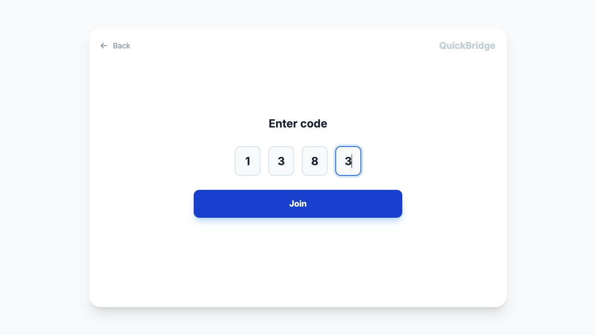
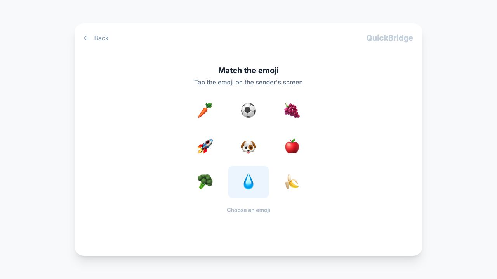
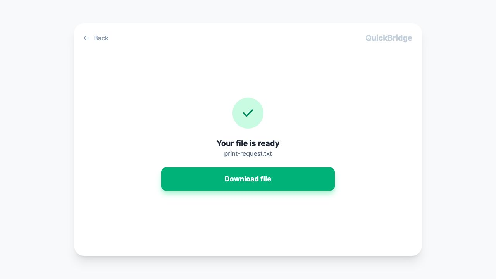

# FileSender

Send files from your phone to a print-shop computer without logging into your email or LINE account. Open the app on both devices and transfer with a **4-digit code**, no account needed.

[Open FileSender](https://filesender-2iwa.onrender.com/) · [Short link](https://bit.ly/ptFile)



*The app displays the name QuickBridge.*

## How it works

**Your device:** select files → get a code. **Print-shop computer:** enter the code → match the emoji (optional) → download.

### 1. Choose what to send: on your device

Open the app and choose **Send**. Tap or drag in your files, or switch to **Text** to paste a message or link. You can send multiple files, up to **100 MB total**.

For an extra check, turn on **Verification** and choose an emoji before selecting **Get Code**.



### 2. Get your code: on your device

Select **Get Code**. The app uploads your files and displays a **4-digit code**. Keep this screen open and use the code on the receiving computer. Each transfer gets a new code; the one pictured is an example.



### 3. Enter the code: on the print-shop computer

Open the same app, choose **Receive**, enter the sender’s code, and select **Join**. No email or LINE login is needed.



### 4. Match the emoji: if verification is enabled

On the receiving computer, select the emoji shown on your device. In this example, it is the rocket. If verification is off, the app skips this step.



### 5. Download and print: on the print-shop computer

When the file is ready, select **Download file**, then open it to print. Once your downloads are saved, select **Finish transfer** to remove the transfer from the server. For multiple files, you can download individual files or use **Download all (ZIP)** for a ZIP. Text transfers show the text with a copy button instead.



Transfers expire after **5 minutes**, and expired uploads are automatically deleted. Files are stored temporarily on the server; download them promptly.

## Run locally

Install [Node.js](https://nodejs.org/), then run:

```sh
npm install
npm start
```

Open [localhost:3000](http://localhost:3000). To use another port, run `PORT=3100 npm start`.

Built with HTML, CSS, vanilla JavaScript, Node.js, Express, and Socket.IO. See [DEPLOY.md](DEPLOY.md) for deployment instructions.

Originally vibe coded with Antigravity to solve a personal print-shop problem.
