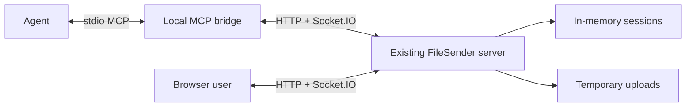

# FileSender MCP MVP design

An agent should be able to send or receive the same text and files as a browser user. The first version adds one **local MCP bridge** beside the agent. The bridge talks to the existing FileSender server; it does not put file bytes into the model's context. The published server URL in this repository is `https://filesender-2iwa.onrender.com/` on Render. After the updated server code is deployed there, the bridge uses it through `FILESENDER_URL`; the local bridge itself stays on the agent's machine. The [interactive diagram](architecture.html) shows the flows.

## Four MCP tools

| Tool | What it does |
| --- | --- |
| `send_text(text)` | Uses the existing upload endpoint. Returns the four-digit code, emoji, and five-minute claim deadline. |
| `send_files(paths[])` | Reads allowed local paths and streams them through the existing upload endpoint. Returns the same handoff details. The server's 100 MB total limit applies. |
| `receive_transfer(code, emoji, outputDirectory?)` | Joins and verifies over Socket.IO, then downloads text or files. Files are saved under an allowed directory; the result contains paths and a receiver handle, not file bytes. |
| `finish_transfer(receiverHandle)` | Confirms receipt and deletes the server's temporary payload. If the agent does not finish, expiry cleans it up. |

The bridge keeps the verified Socket.IO connection and receiver grant until `finish_transfer` or expiry; `receiverHandle` refers to that local state.

The agent passes the code and emoji to the intended recipient through an existing trusted channel. A browser can send to an agent, an agent can send to a browser, and two agents can use the same exchange. A browser sender still uses the existing UI.

## Small server changes that are required

1. **Require emoji verification for every MVP transfer.** Disable the current “security off” toggle in the browser. A four-digit code alone must never claim or download a transfer. A no-emoji mode can return later with a separate long receiver secret and matching UI.
2. **Scope access to the verified receiver.** On success, mint an opaque receiver grant. The bridge uses it on metadata and download requests. The browser redeems a one-use Socket.IO approval token at `POST /api/transfers/:code/redeem`, receives a Secure, HttpOnly cookie, and only then fetches metadata or downloads. `receiver.js` must await redemption before its current metadata fetch. Require a sender token returned by upload when registering the sender socket.
3. **Do not destroy the transfer on wrong guesses.** Count and throttle wrong attempts per claimant/source. Disconnect or block that claimant after repeated failures, but leave the sender's session and files intact. Only a successfully verified receiver becomes the active receiver.
4. **Give the receiver time to finish.** Keep five minutes as the deadline to *start* receiving. Once verified, set a fixed 30-minute receive deadline for the complete file set and `finish_transfer`; the original five-minute timer no longer applies. Clean up on finish or at that deadline, after any active stream closes under a bounded server timeout.

The bridge can reuse `POST /upload`, the existing Socket.IO events, and the existing metadata/download routes after those access checks are added. No broad new transfer API or session refactor is needed for this version.

## Boundaries for the first version

- The bridge runs as a local stdio MCP server and reads/writes only configured directories. It works on any agent machine that can launch a local process and reach FileSender over HTTPS.
- FileSender keeps its current in-memory sessions and temporary disk storage. A server restart still ends active transfers.
- Keep the four tools above. Defer a hosted `/mcp` endpoint, status polling, idempotency keys, checksums, and persistent storage. If an upload response is lost, the sender can make a new transfer; the abandoned one expires after five minutes.
- Check browser ↔ browser, agent ↔ browser, browser ↔ agent, and agent ↔ agent. Also check code-only denial, wrong-guess isolation, and a multi-file receive that crosses the original five-minute mark.

This MVP is implemented by the browser/server changes and the local bridge under `mcp/`. Sessions and files remain temporary.

## Protocol references

- [MCP tools specification](https://modelcontextprotocol.io/specification/2026-07-28/server/tools)
- [TypeScript SDK v1 server guide](https://ts.sdk.modelcontextprotocol.io/server)
